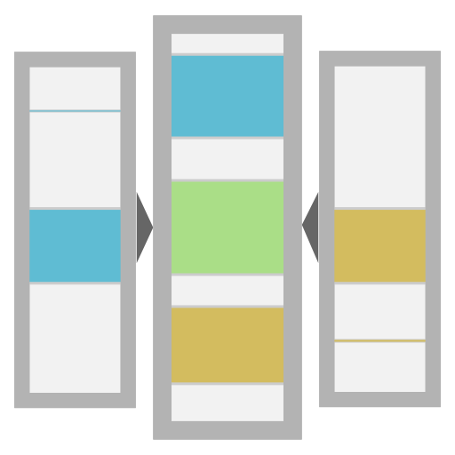
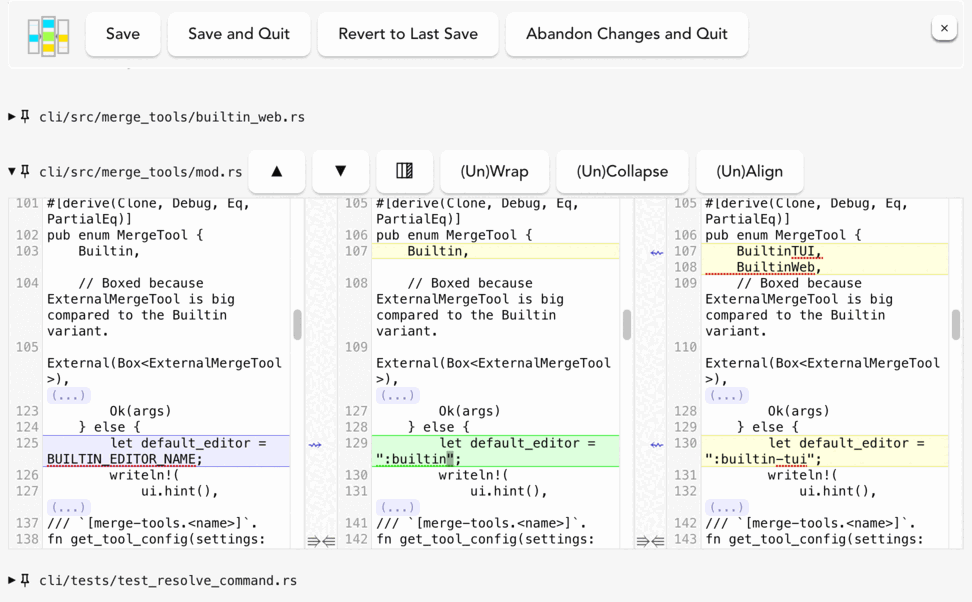

#  Diffedit3

## Overview

The tool in this repo is a UI for editing diffs in a three-pane view. It is
meant to be used with [`jj`](https://github.com/martinvonz/jj), and the core of
it will hopefully become a part of `jj`.

See [below](#potential-uses-outside-jj) for the explanation of the purpose of
`diffedit3` for people less familiar with `jj`.



The interface of `diffedit3` is quite similar to that of
[Meld](https://meldmerge.org/), when used in the [experimental 3-pane diff
editing
mode](https://martinvonz.github.io/jj/v0.14.0/config/#experimental-3-pane-diff-editing).
Meld is far more polished, so you should prefer it to `diffedit3` when and if
you can easily use it. `diffedit3`, however, can be used when Meld would be
difficult to install or difficult to run, as long as a web browser is available
(e.g. over SSH with port forwarding, via WSL, ...).

In order to be as portable as possible, `diffedit3` runs a local HTTP server.
  The UI runs in your browser at `http://127.0.0.1:8080`, quite similarly to how
  [Jupyter](https://jupyter.org) works. Much of the UI is a wrapper around the
  [CodeMirror editor/library](https://codemirror.net/5/). See below for [more
  implementation
  details](#notes-on-implementation-and-alternative-possibilities).

## Installing `diffedit3`

There are several ways to install `diffedit3`.

- You can obtain `diffedit3` from the [Releases page of this
repo](https://github.com/ilyagr/diffedit3/releases/latest). Download the archive
appropriate for your system, unpack it, and put the executable in your PATH.

- If you have Rust installed, you can use `cargo install diffedit3 --locked`.

- If you have [`cargo binstall`](https://github.com/cargo-bins/cargo-binstall),
you can `cargo binstall diffedit3`. It is then recommended to install and use
[`cargo-update`](https://github.com/nabijaczleweli/cargo-update) to update both
`diffedit3` and `cargo-binstall`.

After obtaining the binary, you can test that it woks by running `diffedit3
--demo`.

### A note on the unsupported Tauri binaries

The release page also contains binaries with "unsupported-tauri-gui" in their
name that contain a `diffedit3-gui` executable.

you can use these interchangeably with the regular `diffedit3` executable if you
prefer a proper GUI application (based on [Tauri](https://tauri.app/)) to a
Jupyter-style webapp. If you just want to try it out, run `diffedit3-gui
--demo`.

However, `diffedit3-gui` is minimally supported and has known bugs (mostly with
key bindings) that the author isn't sure how to fix. You would also need to
manually configure `jj` to use it.

## Using `diffedit3` with `jj`

For `jj` 0.18+, `diffedit3` should be pre-configured as a diff editor.
If the `diffedit3` executable is not in your PATH, you may need to set
`merge-tools.diffedit3.program` to the path to the executable (but it may be
better to just move it into the PATH instead).

You can use `jj` with `diffedit3`, for example, as follows:

```
jj split --tool diffedit3
```

You can make `diffedit3` the default diff editing tool by setting
`ui.diff-editor="diffedit3"` in your [`jj` config] ([additional docs]).

Using `diffedit3` as a merge tool with `jj resolve` is possible since version
0.5.0, but requires configuration and is not currently convenient or
recommended. (TODO: hopefully, this will improve shortly).

If you'd like to adjust the config or use `diffedit3` with older versions
of `jj`, you can adapt `jj`'s default TOML config for `diffedit3` from its
[`merge-tools.toml`](https://github.com/martinvonz/jj/blob/main/cli/src/config/merge_tools.toml).

[`jj` config]: https://martinvonz.github.io/jj/v0.14.0/config/#editing-diffs
[additional docs]: https://martinvonz.github.io/jj/latest/config/#experimental-3-pane-diff-editing

## Potential uses outside `jj`

`diffedit3` presents the user with a three-way comparison between two or three
directories. The user can then edit the middle pane, creating any intermediate
version of the data they like. This interface is not novel, Meld can be
configured in the same way. However, I believe it should be better known and
used more.

If you are not familiar with the various `jj` operations where this is useful,
the most obvious use-cases are:

- splitting commits, as I [explained in detail in a feature
request](https://forum.scootersoftware.com/forum/beyond-compare-discussion/general-aa/92039-text-merge-potential-improvements-options-for-vcs-purposes?p=92054#post92054).

- as an interactive version of `git add -p`. This is not currently implemented,
    but `diffedit3` could be set up to show the state of HEAD in the left pane, the state of
    the working copy in the right pane, and let the user edit the staging area in
    the middle pane.
  
    This way, you could easily stage portions of files or you could decide to
    slightly modify the changes you stage from what you have in the working
    copy. This would also be safe: nothing you do would affect the working copy or
    the HEAD commit, until you explicitly commit the staged changes or restore the
    working copy from the staged changes.

The "interactive `git add -p`"  could be implemented by some sort of a script
that would get Git to first materialize the three versions of the repo in three
dirs on disk (perhaps limiting them to the modified files). After `diffedit3` is
done, the script would have to the output and tell git to make that output the
new contents of the staging area. This is along the lines of a [StackOverflow
question](https://stackoverflow.com/questions/9023928/git-add-patch-with-difftool).

Alternatively, it might be easier to make a dedicated tool using something like
[`gix`](https://docs.rs/gix/latest/gix/) or
[`git2`](https://docs.rs/git2/latest/git2/), assuming they provide ways to
easily modify the staging area. 

## Notes on implementation and alternative possibilities

For now, the code is of proof-of-concept quality. I tried to make this useable
enough for people to get a sense of the tool, quickly.

Most of this tool is a web-app, which is a thin wrapper around the [CodeMirror 5
merge plugin](https://codemirror.net/5/demo/merge.html). There is also a small
amount of Rust for IO and to set up the local server (or to set up Tauri).

CodeMirror 5 is obsolete software with bugs that are unlikely to ever be fixed
(especially in the merge plugin). Hopefully we'll move on to use something else
eventually, but currently it has a very convenient feature set for this tool.

Some alternatives to CodeMirror 5 we could consider:

- Codemirror 6 has a [merge plugin](https://github.com/codemirror/merge), but it
  only supports two-pane diffs at the moment. I started a [Discourse
  discussion](https://discuss.codemirror.net/t/fr-three-way-comparison-for-the-v6-merge-plugin/7879)
  with a feature request for three-pane diffs.

    There is no response yet, but from other discussions, it seems that the author
    of CodeMirror is willing to be hired as a consultant to implement new
    features.

- [`mismerge`](https://github.com/BearToCode/mismerge) is promising. It is
  missing some features for now (see the issues in the repo).

### Some examples of CodeMirror5 limitations

- Omitting unchanged blocks is buggy when changing whether the lines are wrapped.
- Diff quality is far from perfect
- No dark theme support
- Hard to tell blank lines from missing lines.
- Who knows how soon it'll be abandoned and unsupported.
- It's difficult to get it to work with modern web frameworks.


## Potential future features and alternatives to them

### A TUI tool with a three-pane diffedit view

This would be nice :).

It should be feasible to make Vim and possibly Emacs support the kind of
interface `diffedit3` provides. I'm not aware of any ready-to-use options for
three-way diff editing of directories. For three versions of a single file (as
opposed to a directory), Vim can do it today.

Even if somebody writes or improves a Vim plugin to do this (which would be
great!), there is also a need for such a tool that does not require the user to
learn the ways of Vim or Emacs.

### Resolving merge conflicts in a 3-pane view

This would be a compromise, see the next section for a more radical and less
feasible approach, as well as alternatives.

Currently, `diffedit3` could be used to resolve conflicts by putting the file
with conflict markers in the center and the left/right sides on the sides. There
are a few limitations:

- (Fixed in `diffedit3 0.5.0`) The tool currently does not work correctly if the arguments are files as opposed
    to directories. This can be fixed (TODO). So, it does not work with `jj resolve`.
- (**Update:** To be fixed in `jj` as described below) Such a view would show many distracting useless diffs that can be trivially resolved
  (and should be resolved in the center panel). The user would need help navigating
  to the relevant parts (conflicts).
- AFAIK, CodeMirror's merge plugin does not support `Go to next/previous conflict`
  button that would go to the next diff where the center pane differs from both
  left and right sides. (This would also correspond to going to the next conflict in
  the view I described, there's no need to look at conflict markers for this)

(**Update:** This is the plan.) Alternatively, a tool like `jj` could adjust the left/right sides to remove the
diffs that can be trivially resolved before sending the files to `diffedit3`. This would
make the conflicts much easier to navigate for experienced users, but more confusing for
new users.

**Update:** To reduce confusion, we might eventually show different views
of the merge: the original files, the simplified files as described in
the previous paragraph, the original jj conflict view vs the version
edited by the user.

### Resolving merge conflicts in a 4-pane view

A UI that shows the base of the conflict, the two sides of the conflict, and an
output pane for the user to resolve the conflicts in would be a desirable
addition to `diffedit3`. It is likely laborious to add. I am not aware of a
preexisting JS library that implements such a UI. On the other hand, there are
many existing alternative programs of varying levels of polish that can do this.

As an alternative for use with `jj`, I recommend setting up either
[`kdiff3`](https://apps.kde.org/kdiff3/)
([binaries](https://download.kde.org/stable/kdiff3/)) or [VS
Code](https://code.visualstudio.com/) as a merge tool for this purpose today.
The latter can be used to merge files on a remote computer, using its Remote
Development mode. `jj` supports resolving conflicts with both [out of the
box](https://martinvonz.github.io/jj/v0.14.0/config/#3-way-merge-tools-for-conflict-resolution).

There are many other alternatives, including paid ones like Araxis/Beyond
Compare.

### UI Changes, e.g. a tabbed view instead of scrolling, change size of the editors, ...

Patches welcome :). Any such changes run the risk of running into CodeMirror5's
merge plugin's bugs, so be careful checking that your changes work.

### Buttons to take all changes from  the left/right pane

This is planned. This requires destroying the CodeMirror widget and creating a
new one (in order to avoid CodeMirror5 bugs).

### Ability to edit left/right side, use `diffedit3` as a scratchpad

Need to check if this triggers any bugs. See also
https://github.com/ilyagr/diffedit3/issues/51.

## Building `diffedit3` from source

For the local server version, running `cargo build --release` should suffice. This assumes that the compiled javascript in `webapp/dist` is up to date and therefore does not require installing `npm`.

For the GUI (Tauri) version, the procedure is:

1. Install Rust
2. Install the `cargo-tauri` CLI (TODO: Better explanation.). Do not use the `node` Tauri CLI; it does not seem to work with the Rust-focused directory structure of this project.
3. Install `node`/`npm`. `cd` to the `backend-tauri` dir.
4. Run `npm install` (only has to be done once).
5. Run `cargo tauri build`. Do **not** use the regular `cargo build`, it produces
   a broken binary.

In both cases, the binary will be produced in the `target/release` dir.


## Development

### A note on branches

The commit history of the `dev` branch is messy. The branch may be force-pushed
at any time. 

Pre-v0.0.1 commits are also messy, and are on the `v0.0.1-ish` branch.

### Prerequisites


### Option 1: using `backend-local-server`

1. (If you are planning to touch HTML/CSS/JS) Install `node`/`npm`, run `npm clean-install`.
2. (If you are touching HTML/CSS/JS) Run `npm run watch` in a separate terminal. This will auto-update `webapp/dist` whenever you change files in `webapp/`.
3. Use `cargo run -p backend-local-server -- --demo` to run the app. If touching
   the webapp, remember to manually make sure that `npm run watch` is not
   showing any errors before running/building the app.
4. (Recommended) Set up your editor to format on save using [Prettier] and
   `cargo +nightly fmt`. For VS Code, you can install https://marketplace.visualstudio.com/items?itemName=esbenp.prettier-vscode and https://marketplace.visualstudio.com/items?itemName=rust-lang.rust-analyzer, and then add the following to your workspace (or global) `settings.json`: 

    ```json
    "[rust]": {
        "editor.formatOnSave": true
    },
    "[typescript]": {
        "editor.formatOnSave": true
    },
    "[html]": {
        "editor.formatOnSave": true
    },
    "[yaml]": {
        "editor.formatOnSave": true
    },
    "[github-actions-workflow]": {
        "editor.formatOnSave": true
    },
    ```

5. Before pushing, run `npm run build` to avoid issues with the CI. This also runs `prettier` via `npm run format`.

### Option 2: using `backend-tauri`

1. Follow the steps of the "building" procedure for the GUI/Tauri version. You can skip the last building step.
2. Run `cargo tauri dev -- -- --demo` (note the two `--`s). This will
   automatically refresh the app to use the latest version of the webapp from
   `webapp/` (as opposed to `webapp/dist) in dev mode. 

## Medium-term TODOs

### Allow ignoring whitespace

This [seems unsupported by
CodeMirror](https://discuss.codemirror.net/t/codemirror-diff-ignore-whitespaces/148/2).

See also "better merging" below. Mismerge does seem to support this.

### Keep track on which file tabs were opened on reload

Would need to send data to the server regularly.

### Regularly check whether the local server is alive

This mainly requires a UI. The server can have a `/api/ping` route. We could
verify if it's the same server that started the webapp at the same time, though
it's probably better to make a more general check of whether the on-disk
directory state is as expected (see the next item).

### Warning for unsaved changes, fancier save button

Keep track of whether the content changed since last save. Grey out the save
button in this case. (This means that while saving, we need to keep track of
both the last successfully saved state and the state we're trying to save). Tell
the user when the last successful save happened.

### Better merging
Simpler: look into configuring parameters to the diff library.

Hard: Do calculations in Rust using a newer library. Would require a UI that can
import such a diff. `mismerge` is close.

### Save per-file

Simple part: don't overwrite unchanged files

Harder: separate save buttons per file and maybe an overall save button.

## Shorter-term TODOs and known bugs

### If the file is deleted on the right side, the tool will write an empty file in its place when saving. It should not do that.

### For the Tauri app (`diffedit3-gui`), Ctrl-C/Cmd-C for copy doesn't seem to always work. Ctrl-Up and Cmd-Up for going to the previous diff also doesn't seem to work. The webapp `diffedit3` version is not affected

### Toggling options like line-wrapping, collapse of similar regions, or the right pane loses the CodeMirror viewport and selection

This is because the editor needs to be recreated to avoid CodeMirror5 bugs. The
cursor position is preserved.

### Pinned view menu has an ugly scrollbar when the window is narrow.

This has to do with the fact that `<details>` do not seem to support `display:
flex`. The solution would be to replace `<details>` with a custom
implementation.
